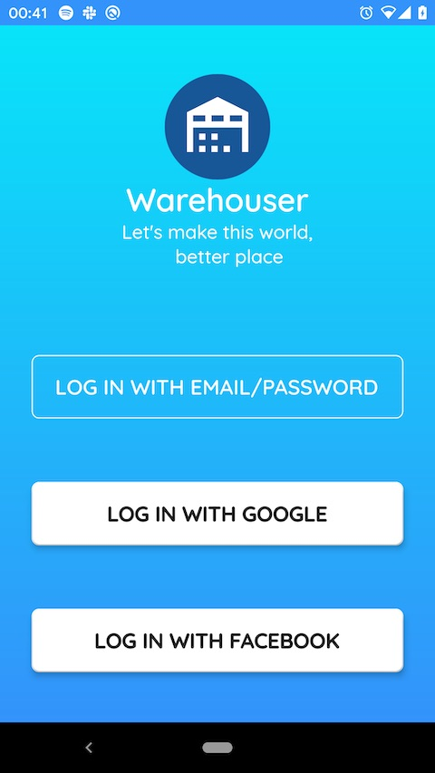
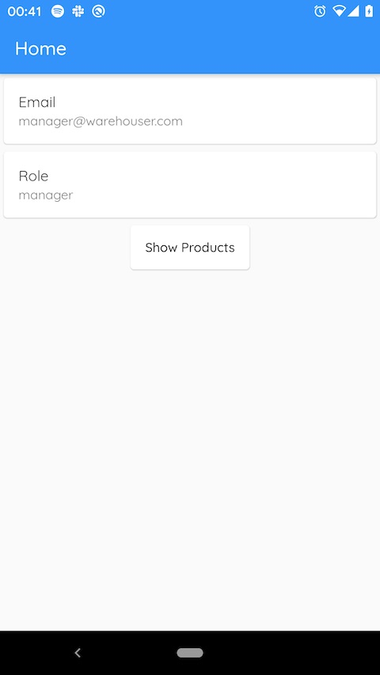
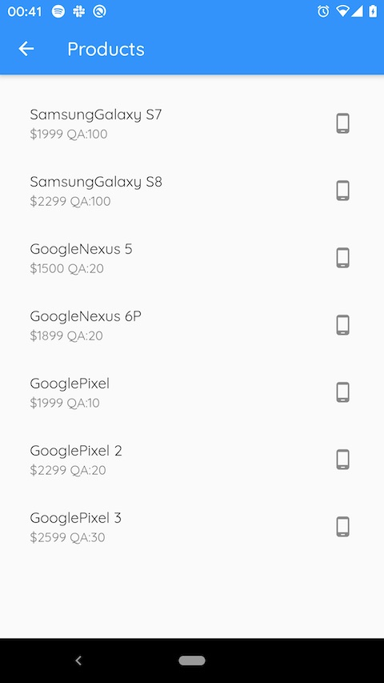
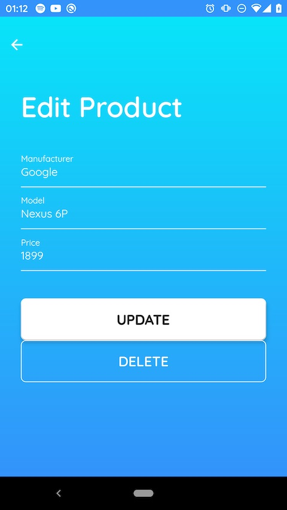

# MUI Project

## Mobile app

Flutter app

| Login | Home | Products | Edit |
| --- | --- | --- | --- |
|  |  |  |  |

## Backend server

Golang backend
[httprouter](https://github.com/julienschmidt/httprouter)

### API

- GET `/products` - get all products
- GET `/products/:id` - get product with :id
- POST `/products` - create new product from JSON request body
- PUT `/products/:id` - update product with :id with JSON request body
- DELETE `/products/:id` - delete product with :id
- GET `/deltaQuantity/:id/:delta` - chnage quantity of product of :id by applying :delta to its current quantity

## Authorization Service

- [Hydra](https://github.com/ory/hydra)
- [OAthkeeper](https://github.com/ory/oathkeeper)

